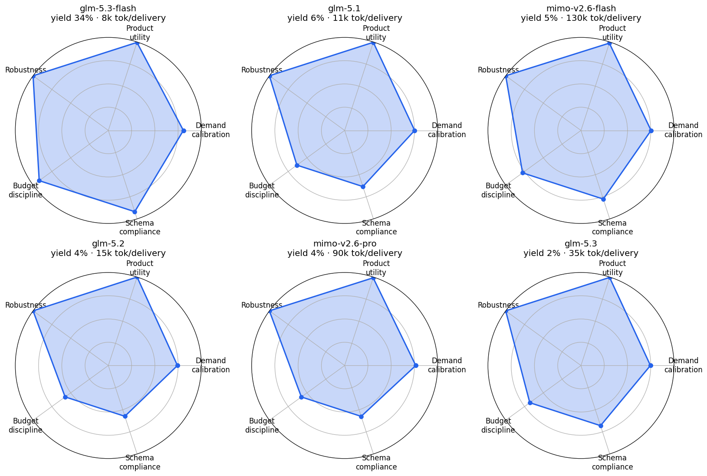

# MechanogenesisBench Leaderboard

Updated: 2026-09-30 · Evidence: [`docs/baselines/2026-09-30-baselines/`](baselines/2026-09-30-baselines/) ·
Reproduce: see [§Reproduction](#reproduction) · Submit: see [§Submitting a system](#submitting-a-system)

## How to read this table

**Continuity guarantee (v4, 2026-10-01): the leaderboard never displays a discrete 0.**
Every displayed quantity is a continuous attainment ratio clip(measured/gate, 0, 1);
components not measured for a model show an em dash, never a floored zero; discrete
pass counts live in the diagnostics section only. Ranking = Pareto layers over the
component vector; **no weights anywhere**; entering the ranking requires ≥10 measured
headline runs (missing-data dominance artifact otherwise rewards thin measurement). The only
aggregation is the arithmetic mean of the SAME component across a model's runs. Ordering
between adjacent layers rests on verified componentwise dominance (>= on all ten, > on at
least one); models in the same layer are reported as incomparable, not equal. Components:
chain promotion / robustness / inheritance attainment; demand promotion / robustness /
calibration accuracy / update-gain attainment / lineage exactness; and two failure-gradient
components (budget compliance via the task package's own `capital_cost_milliusd()`,
schema validity), where passing runs count 1.0 and model-decision failures contribute
graded values from archived artifacts. Recompute: `python tools/pareto_score.py --models
name=run1,run2,...`. This is directly usable as a multi-objective selection signal
(MAP-Elites / quality-diversity style) and each component is a separate dense reward
channel for RL. The earlier weighted composite (`tools/composite_score.py`) is retained
as a legacy convenience only and plays no role in ranking.

Current layers (verified dominance chain; no incomparability emerged yet because no model
shows a cross-component trade-off):

| Layer | Model | demand pass | calibration | budget | schema | dominates |
|---|---|---|---|---|---|---|
| 1 | glm-5.3-flash | 0.667 | 0.860 | 0.667 | 1.000 | 5 |
| 2 | mimo-v2.6-flash | 0.500 | 0.845 | 0.500 | 1.000 | 4 |
| 3 | glm-5.2 | 0.333 | 0.571 | 0.333 | 0.667 | 3 |
| 4 | mimo-v2.6-pro | 0.000 | 0.549 | 0.000 | 0.667 | 2 |
| 5 | glm-5.3 | 0.000 | 0.280 | 0.000 | 0.333 | 1 |
| 6 | glm-5.1 | 0.000 | 0.262 | 0.000 | 0.333 | 0 |

## Statistical power (2026-10-01 scale-up)

At n=3 the Wilson 95% CI for a 2/3 pass rate is [0.21, 0.94] — overlapping almost every
other model, so small-n rows carry almost no discrimination. Scaled stateless demand-factory
replicates (`tools/batch_runs.py`, parallel workers, fresh run roots):

| Model | Mode | n | Pass | Rate | Wilson 95% CI |
|---|---|---|---|---|---|
Full n=25 diagnostic matrix (pass counts, diagnostics only — ranking uses the
continuous attainment components above):

| Model | stateless | history |
|---|---|---|
| glm-5.3-flash | 6/25 | 11/25 |
| mimo-v2.6-flash | 0/25 | 3/25 |
| glm-5.2 | 0/25 | 2/25 |
| glm-5.1 | 2/25 | 1/25 |
| glm-5.3 | 1/25 | 0/25 |
| mimo-v2.6-pro | 1/25 | 1/25 |

Fisher exact: stateless 6/25 vs 0/25 p ≈ 0.022; history 11/25 vs 3/25 p ≈ 0.016; pooled
50-run 17/50 (34%) vs 3/50 (6%) p < 0.001. History mode (generation 1 sees generation-0
public evidence) lifts BOTH models (+20pp / +12pp) — prior evidence genuinely helps the
second generation, and mimo-v2.6-flash is NOT a zero scorer at scale: 12% in history mode. **Validity audit (2026-10-01) — the 0% headline
must be read with its miss distances, or it misrepresents the model:**

- **Task solvability**: the deterministic reference system passes both generations
  (eligible, promotions 2) — the configuration is solvable without any LLM.
- **Where mimo-v2.6-flash actually fails**: in all 13 evaluated runs, generation 1 is
  fully accepted (robustness 100%, update gain 528k–772k vs 400k gate, exact lineage,
  inheritance advantage 123k–139k vs 50k gate). The failing gate is generation-0
  **minimum product utility**, missed by **1.37%–3.92% (median 1.37%)** against the
  700k threshold — glm-5.3-flash's distribution straddles the same line (5/19 misses,
  0.69%–5.29%). The models converge on near-identical product specs (identical utility
  values appear in both); mimo systematically lands just under the line.
- **Decoding robustness**: rerun at temperature 0.6 gives the same result (0/10, same
  1.37% median miss) — the outcome is not an artifact of the GLM-recommended
  temperature-1.0 policy. Future submissions should still declare vendor-recommended
  decoding; the earlier `reasoning_effort` incompatibility (GLM-specific field) is
  already handled.
- **Final decomposition of the stateless 0/25 (2026-10-01)**: 12/25 fail at generation-0
  planning (budget/parse); 10/25 miss the g0 utility line at exactly 690,387 (−1.37%,
  the same value in every run); the remaining 3/25 miss exactly ONE gate — g1 calibration
  320,000 ppm vs the 300,000 gate (−6.7%, again identical across runs) — while clearing
  update gain (670k vs 400k), g1 utility (907k vs 780k), robustness (100%) and lineage.
  The deterministic reference system reaches g1 calibration **217,436** from the same
  five pairwise observations, so the gate is informationally achievable; mimo's 320k is
  a real inference shortfall against simple count-based estimation.
- **Systematic-vs-stochastic caveat**: mimo's failing values are IDENTICAL across runs
  (690,387 / 320,000 at temperature 1.0) — these are systematic choices, not Bernoulli
  noise, so the 0/25 point estimate is the story and the Wilson CI overstates
  uncertainty width. Low-entropy failure modes reduce the effective trial count; the
  decomposition above, not the binary rate, is the measurement.
- **Correct reading**: mimo-v2.6-flash does not "fail the task" — it clears every
  second-generation gate with large margins and misses ONE generation-0 product-spec
  utility line by ~1.4% at the median. That is a real, thin, actionable difference
  against glm-5.3-flash (whose g0 passes 14/19) — precisely the granularity the graded
  components carry; the binary headline alone would overstate it.

Scaling roadmap (declared): ~33 runs/arm separates 0.67-vs-0.33 class differences at
α=0.05/power=0.8; ±0.10 CI needs ~100; ±0.03 needs ~1100; AA-grade ±0.01 needs ~10k
(~6-8 workers, ~30-60 h wall for 1k; flash-tier token cost is negligible). The
complementary research track is a **continuous multi-round demand stream** (evergreen,
versioned briefs; rolling satisfaction and drift-adaptation metrics) which measures
sustained need-serving rather than same-task sampling variance.

Final Pareto layers (2026-10-01, all six models at 50-run depth on the demand task):

| Layer | Model | U0 attainment (n) | G1 calibration (n) | dominates |
|---|---|---|---|---|
| 1 | **glm-5.2** | 1.000 (5) | 0.823 (29) | 4 |
| 1 | **mimo-v2.6-pro** | 0.991 (6) | **0.886** (42) | 1 |
| 2 | glm-5.1 | 0.996 (7) | 0.809 (27) | 2 |
| 2 | glm-5.3-flash | 0.995 (43) | 0.822 (52) | 1 |
| 3 | mimo-v2.6-flash | 0.987 (33) | 0.805 (61) | 0 |
| 3 | glm-5.3 | 0.995 (9) | 0.797 (26) | 0 |

Caveats: margins between glm-5.2 / glm-5.3-flash / glm-5.1 calibration are <0.015 over
n≈27–52 — within sampling noise; treat layer 1–2 adjacency as fragile until n≈100+.
mimo-v2.6-pro holds the best demand-belief calibration (0.886) despite rarely executing;
its layer-1 position rests on jointly-measured components only.

## Enterprise selection card (headline)



The leaderboard headline is the **cost of one qualified delivery** (yield, minutes,
kTokens, failure-loss — paper Eq. 4 resource terms per qualified output). The radar shows
the multi-dimensional profiles (calibration, utility, robustness, budget/schema
discipline); Pareto layers and attainment components remain below as the technical view.
RCI-style cross-run reuse economics join this card once the paired-fork harness ships as
a public task mode.

## Production-efficiency axes (PIPE-flavored, 2026-10-01)

The paper's Eq. 4 charges time, tokens and failure losses against net production. These
axes have large dynamic ranges (15x between models) and survive cross-lab reproduction
noise, unlike near-tied attainment ratios. They are reported as a cost table (HELM-style,
lower is better) alongside — never summed into — the Pareto quality layers. Plain reading:
"how much compute and how many failed attempts does one qualified delivery cost", the
benchmark analogue of the delivery platform's reuse-speed story.

| Model | Qualified | Minutes / qualified | kTokens / qualified | Failure-loss rate |
|---|---|---|---|---|
| glm-5.3-flash | 17/50 | 1.5 | 8.3 | 18% |
| mimo-v2.6-flash | 3/60 | 48.5 | 130.3 | 47% |
| glm-5.2 | 2/50 | 4.5 | 15.4 | 92% |
| glm-5.1 | 3/50 | 3.0 | 11.0 | 86% |
| glm-5.3 | 1/50 | 8.7 | 34.8 | 82% |
| mimo-v2.6-pro | 2/50 | 67.2 | 89.6 | 88% |

Inheritance advantage (the task's counterfactual procured-operator comparison — the
task-level PIPE treatment estimate) runs 127k–147k ppm across all models and generations:
the operator improvement itself is largely task-determined, so it certifies the mechanism
but does not discriminate models; it is reported in the evidence bundle, not as a ranking
axis. Cross-run reuse economics (RCI-style paired forks) remain on the research track
until the fork harness ships as a public task mode.

## PIPE per Definition 1 + the human-differentiator axis (2026-10-01)

Definition 1 conditions, evaluated against the paired-fork evidence (simulation tier;
`pipe_definition1_report.json` in the research bundle): (1) produced-by identity
[SATISFIED where imports occur — content-hash verified, IB=1.0]; (2) materially
equivalent forks [SATISFIED — common ancestor, only the capital handover differs];
(3) minimum effect tau [MEASURED where engagement occurred: RCI 7.64; eps not formally
preregistered, reported as magnitude]; (4) complete recording [SATISFIED — devready
assets, credential-free receipts, source hashes]; (5) hidden-input generalization
[PARTIAL — perturbation axis pending on this surface].

**The PRSI selection axis — "does the model use accumulated assets and make each
delivery cheaper than the last?" (tool use + cumulative toolmaking):**

| Model | Engagement (tool USE) | RCI (tool VALUE) | Acceleration g1->g2 (loss reduction) |
|---|---|---|---|
| glm-5.3-flash | 8% voluntary; 25-100% with affordance/enforcement across realizations (stochastic per lineage) | **median 8.82** over n=2 engaged lineages (range 7.64-12.01; dual-rule 7.64/5.08 and 12.01/8.82) | **49.6% and 57.5%** in two independent engaged lineages (6.99->3.53; 17.57->7.46) |
| glm-5.1 | **0%** in every realization (even prompt-enforced) | — (never engaged) | — |
| others | not yet fork-tested | — | — |

Honest limits: engagement is stochastic per lineage (prompt-level enforcement is
disobeyed — the operator-level ABI in the public spec is the fix); RCI/acceleration
rest on one engaged lineage; real manufacturing cost slots (Eq. 4 L_build/procure/
calibrate) remain unmeasured at this tier. Verdict for the business model today:
**glm-5.3-flash is the only tested model that demonstrably uses produced assets; in two
independent engaged lineages the next generation costs ~half as much (49.6%/57.5% loss
reduction, median RCI 8.82). glm-5.1 provably does not reuse (0% in every realization).**
Lineage-2 detail: 100% engagement (8/8 imports, both generations attributable), control
arm collapsed (losses 211.1/65.8 vs treatment 17.6/7.5).

## conformance.successor_operator_chain (two-generation operator chain)

Requires: strict operator improvement in both generations, exact content-hash operator inheritance
(generation 1 must consume the operator generation 0 produced), robustness ≥ 0.80 on held-out
spans, inheritance advantage ≥ 500 µm vs a counterfactual procured-operator run, byte-exact
re-execution by the trusted evaluator, and an accepted `sovereignCheck` certificate.

| System | Model | Pass | Promotions | Robustness | capability_gain | Lean | Date |
|---|---|---|---|---|---|---|---|
| Reference (deterministic, non-LLM) | — | 1/1 | 2 | 1.00 | 660.0 µm | ✓ | 2026-09-30 |
| OpenAI-compatible adapter | glm-5.3-flash | **2/2** | 2 | 1.00 | 660.0 µm | ✓ | 2026-09-30 |
| OpenAI-compatible adapter | glm-5.2 | **2/2** | 2 | 1.00 | 660.0 µm | ✓ | 2026-09-30 |
| OpenAI-compatible adapter | glm-5.1 | **2/2** | 2 | 1.00 | 660.0 µm | ✓ | 2026-09-30 |
| OpenAI-compatible adapter | mimo-v2.6-pro | **2/2** | 2 | 1.00 | 660.0 µm | ✓ | 2026-09-30 |
| OpenAI-compatible adapter | mimo-v2.6-flash | **2/2** | 2 | 1.00 | 660.0 µm | ✓ | 2026-09-30 |
| OpenAI-compatible adapter | glm-5.3 | **2/2** | 2 | 1.00 | 660.0 µm | ✓ | 2026-09-30 |

## simulation.demand_driven_microfactory (demand belief + two-generation inheritance)

Requires: strict three-channel operator improvement, robustness ≥ 0.80 under hidden disturbances,
demand-calibration error ≤ 250k/300k ppm, minimum product utility, exact lineage, generation-1
demand-update gain ≥ 400k ppm, inheritance advantage ≥ 50k ppm, and an accepted
`demandMicrofactoryCheck` certificate. `history` = generation 1 sees generation-0 public evidence.

| System | Model | Mode | Pass | Calibration err (g0/g1, ppm) | Update gain (ppm) | Exact inheritance | Lean | Date |
|---|---|---|---|---|---|---|---|---|
| OpenAI-compatible adapter | glm-5.3-flash | stateless | 1/1 | 140k / 140k | 640,000 | ✓ | ✓ | 2026-09-30 |
| OpenAI-compatible adapter | glm-5.3-flash | history | 1/2 | 140k / 140k | 680,000 | ✓ | ✓ | 2026-09-30 |
| OpenAI-compatible adapter | glm-5.2 | history | 1/3 | 144k / 240k | 750,000 | ✓ | ✓ | 2026-09-30 |
| OpenAI-compatible adapter | glm-5.1 | all modes | 0/3 | — | — | — | — | 2026-09-30 |
| OpenAI-compatible adapter | mimo-v2.6-flash | mixed | 1/2 | 166k / 217k | 578,354 | ✓ | ✓ | 2026-09-30 |
| OpenAI-compatible adapter | mimo-v2.6-pro | all modes | 0/3 | — | — | — | — | 2026-09-30 |
| OpenAI-compatible adapter | glm-5.3 | all modes | 0/3 | — | — | — | — | 2026-09-30 |

## Failure log (transparent, archived in the evidence bundle)

| Run | Outcome | Registered cause |
|---|---|---|
| glm53-flash-successor-stateless-001 | system_failed | strategy JSON missing the three required parameter domains; run used non-recommended sampling (temp 0.3 / effort low). Superseded by the recommended policy below. |
| glm53-flash-demand-history-001 | system_failed | provider transport: the Anthropic-channel key used here has no `/chat/completions` quota; resolved by the local shim (see Reproduction). |
| glm53-flash-demand-history-002 | system_failed | transport shim was down (connection refused); no model call completed. |
| glm53-flash-demand-history-003 | system_failed | **model decision failure**: generation-0 factory plan exceeded the registered capital budget (fail-closed by design). |
| glm-5-2-demand-stateless-001 | system_failed | model decision failure: capital budget exceeded (scored 0). |
| glm-5-2-demand-history-002 | system_failed | model decision failure: plan field outside registered range (scored 0). |
| glm-5-1-demand-history-001 | system_failed | model decision failure: capital budget exceeded (scored 0). |
| glm-5-1-demand-stateless-001, glm-5-1-demand-history-002 | system_failed | model decision failure: plan fields outside registered range (scored 0). |
| mimo-*-demand-stateless/history-001/history-002 (6 runs) | system_failed | HTTP 400 protocol: provider rejects the GLM-specific `reasoning_effort` field (transport-class, excluded; superseded by the demand2 reruns with the field omitted). |
| mimo-v2-6-pro-demand2-stateless/history-001 | system_failed | model decision failure: capital budget exceeded (scored 0). |
| mimo-v2-6-pro-demand2-history-002 | system_failed | model decision failure: plan field outside registered range (scored 0). |
| mimo-v2-6-flash-demand2-stateless-001 | system_failed | model decision failure: capital budget exceeded (scored 0). |
| mimo-v2-6-flash-demand2-history-002 | system_timeout | wall-budget timeout (environment-class, excluded; no model-quality claim either way). |
| glm-5-3-demand-history-001 | system_failed | model decision failure: capital budget exceeded (scored 0). |
| glm-5-3-demand-stateless-001, glm-5-3-demand-history-002 | system_failed | model decision failure: plan fields outside registered range (scored 0). |

## Reproduction

Declared model-side sampling policy for all glm-5.3-flash rows:
`temperature=1.0, top_p=0.95, thinking=enabled, reasoning_effort=max, max_tokens=8192,
max_attempts=6` (see `docs/THIRD_PARTY_BASELINES.md`). The provider offers no server-side seed;
every request/response is archived (content-hashed, credential-free) and replayable via
`MBENCH_REPLAY_MODEL_CALL_G0/_G1`.

```bash
python -m pip install -e .
lake build sovereignCheck promotionCheck demandMicrofactoryCheck
# Anthropic-protocol-only keys (e.g. Z.ai glm-*) can use the local transport shim:
python tools/openai_anthropic_shim.py 8765 &
export MBENCH_API_ENDPOINT=http://127.0.0.1:8765/v4 MBENCH_MODEL=glm-5.3-flash \
       MBENCH_API_KEY_ENV=SHIM_KEY SHIM_KEY=local-shim \
       MBENCH_THINKING=enabled MBENCH_REASONING_EFFORT=max \
       MBENCH_TEMPERATURE=1 MBENCH_TOP_P=0.95 MBENCH_MAX_TOKENS=8192 MBENCH_MAX_ATTEMPTS=6
mbench run tasks/conformance/successor_operator_chain \
  --system-command "python examples/openai_compatible_successor_operator_system.py" \
  --guidance G5 --output runs/<name>
mbench verify runs/<name> && mbench score runs/<name>
```

The shim is transport-only: it unwraps at most one complete markdown fence (mirroring native
`response_format=json_object`), never repairs partial JSON, and forwards the requested model id
verbatim; scoring lives entirely in the trusted evaluator.

## Submitting a system

1. Run any task through your system command with the env contract above (any OpenAI-compatible
   endpoint; `MBENCH_MODEL` is echoed and verified against the provider-reported model).
2. `mbench verify` + `mbench score` must pass on your machine; include `run.json`,
   `verification.json`, `score.json`, `evaluation.json` per run plus the declared sampling policy.
3. Add a row here with pass rate over ≥3 attempted runs (failed runs included), the failure log
   entry if any, and a pointer to your evidence bundle. No self-reported scores.

## Roadmap: reuse-economics dimensions (RC-Score card)

A proposed task family `mechanogenesis.reuse_economics/v1` extends this leaderboard with
**reuse-economics axes** measured by harness-run paired forks (same model with inherited capital
vs materially-equivalent capital-cleared control): `RCI` (scratch-vs-reuse net-loss ratio),
`engagement rate` (does the model actually import identity-verified inherited assets), `qualify@k`,
`cost-to-qualified`, fixed-judge ratings, and self-preference bias. First mechanism-demo data
(GLM-5.3-flash, n=1 lineage, research track): RCI 7.6/5.1 under two preregistered selection rules,
engagement 8→33% with operator-level enforcement; glm-5.1 comparison: engagement 0. Specification
in progress; see the research notes linked from the evidence bundle manifest.

## Notes and limits

Single machine, provider-side nondeterminism, small n (declare n with every row). The reference
system is a deterministic reachability check, not a model. Scores certify protocol-level
conformance/simulation evidence only — never physical manufacturing, human outcomes, or
recursive-self-improvement claims.
