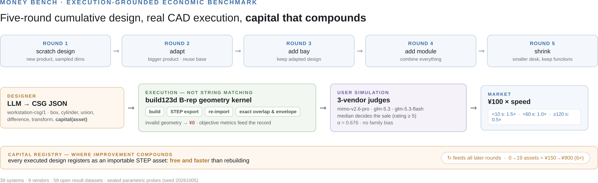
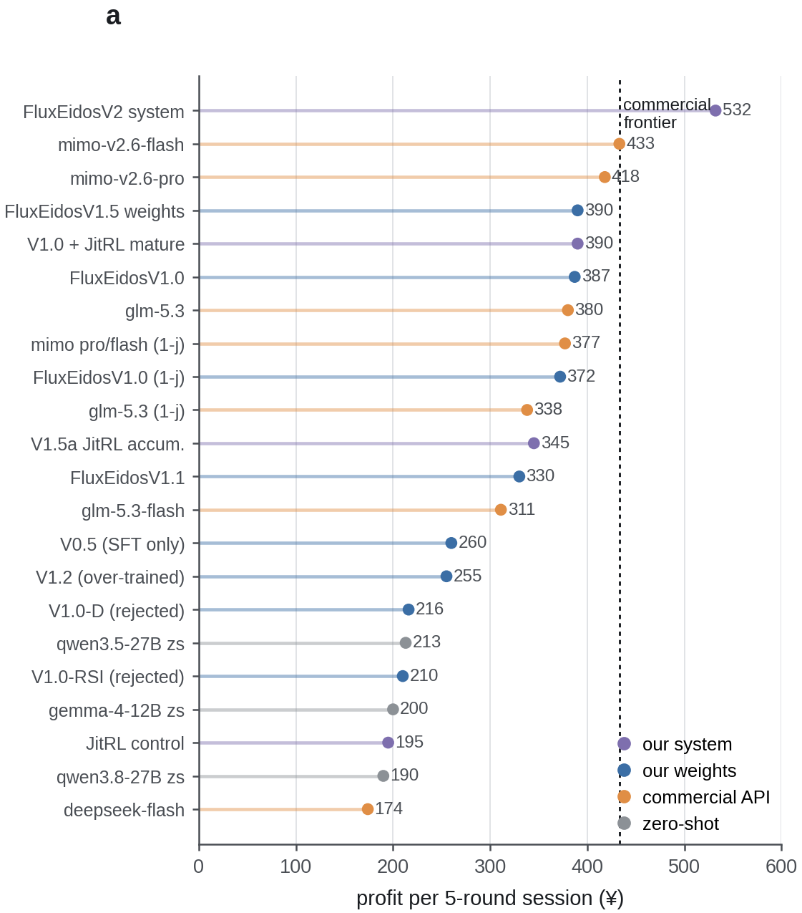
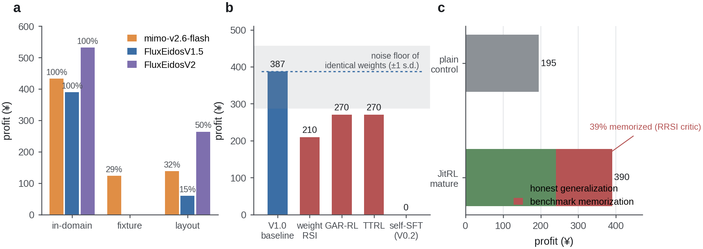
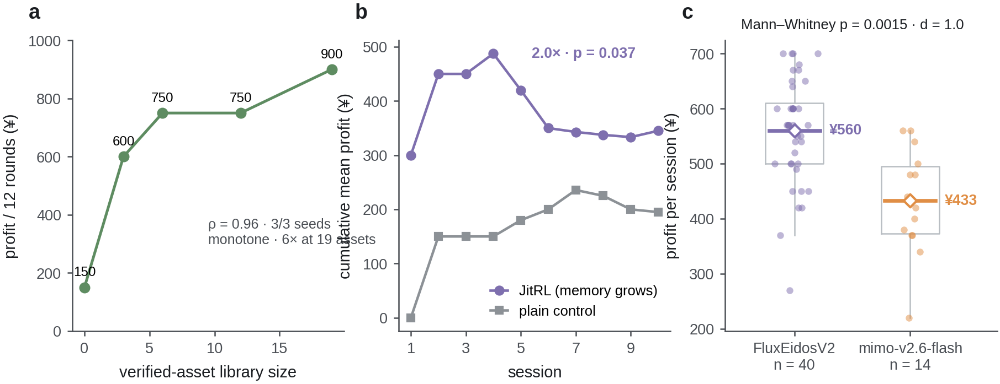
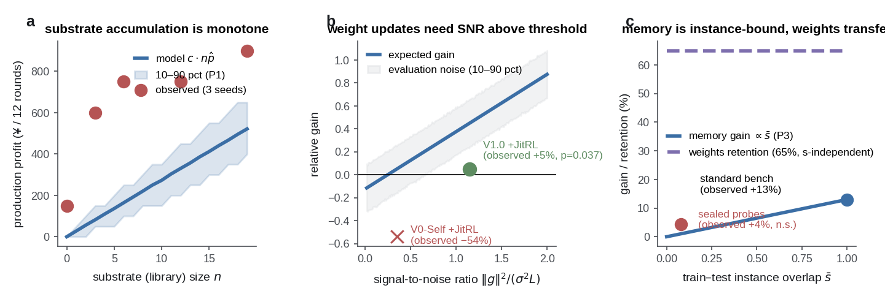
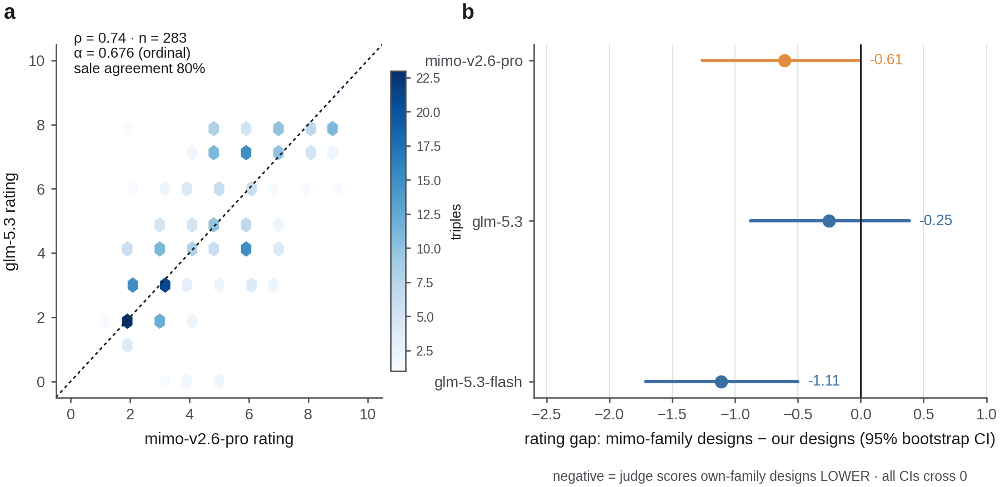

# Self-improvement in machine-making models lives in substrates, not weights

**Exuberant Witness** *¹*

¹ MechanogenesisBench Project (affiliation to be completed)

Correspondence: corresponding-author email to be completed

---

## Abstract

Large language models are increasingly used to design physical artifacts, and a growing literature improves them at such tasks through experience — by fine-tuning on self-generated data, by reinforcement learning on the weights, or by accumulating memory and skills around a frozen model. Where the improvement actually lives, however, has not been measured. Here we introduce Money Bench, an open benchmark that prices the question economically: across five rounds of cumulative product design, a design earns money only if it executes as real computer-aided-design geometry (build123d boundary representation; build, STEP export, re-import and exact measurement), satisfies a three-vendor judge panel acting as the customer, and is delivered fast enough for speed-tiered pricing; every executed design then becomes importable capital for later rounds, so improvement can compound the way it does in a real workshop. Evaluating 39 systems from 9 vendors, we find that (1) domain shift collapses earnings for every system, the strongest commercial model retaining 29–32% of in-domain profit; (2) all four families of weight-level self-improvement tested at 9-billion-parameter scale fail to improve a trained baseline, because the noise floor of repeated evaluation (±¥85 per session on identical weights) exceeds per-update drift at the ~30-sample generation budget; and (3) 39% of cross-session experience gain is benchmark memorization, revealed by regularization that screens self-similar memories. A minimal formal model explains all three findings — verified substrates accumulate monotonically, gradient updates inherit a signal-to-noise threshold, and memory is instance-bound — and prescribes freezing the weights: a curated asset library compounds production profit sixfold, cross-session experience doubles it, and a five-mechanism inference-time stack takes a 9-billion-parameter open model past the strongest commercial frontier model under symmetric three-vendor judging (¥532 versus ¥433 per session, *P* = 0.0015, Cohen's *d* = 1.0, *n* = 40), at roughly one-thousandth of its training compute.

---

## Introduction

Machine-making — designing physical artifacts that must assemble, fit and sell — is becoming a language-model task. Neural CAD generation has progressed from operation sequences¹⁴ to text-conditioned design¹⁵ and language models that write CAD code¹⁶, while execution-verified benchmarks have become the standard for evaluating coding agents⁹,¹⁰. The natural next question is economic: as a model accumulates experience making machines, does the system earn more money — and does the gain live in the weights, in memory, or in the artifacts?

The field's default answer is the weights. Self-training loops filter self-generated solutions back into fine-tuning¹⁻³; self-rewarding models bootstrap their own preference signal²; reinforcement learning shapes reasoning directly⁴, building on the preference-learning foundation²¹ and instruction-tuning stack²² at much larger sample scales. A parallel line improves the system rather than the parameters: verbal reflection in episodic memory⁵, executable skill libraries⁶, operating-system-style memory management⁷ and memory-stream agents⁸; chain-of-thought prompting and self-consistency²³,²⁴ established that substantial gains need no training at all, and tool-use and acting frameworks²⁵,²⁶ extended this to agents. These two families are rarely compared on one ruler, and existing CAD benchmarks¹⁴⁻¹⁶ measure single-shot static quality rather than cumulative economics.

Here we introduce Money Bench, which prices the question (Fig. 1). Five-round cumulative demands — scratch, adapt, extend, combine, compress — drive designs that must execute as real build123d boundary-representation geometry; execution failures earn nothing. A three-vendor judge panel simulates the customer; sales pay ¥100 × a speed multiplier, so faster is worth more; and each round's validated design registers as importable capital, free and faster than rebuilding. Compounding is measurable, causal and open to inspection. Evaluating 39 systems from 9 vendors (Fig. 2), we obtain three results (Fig. 3): domain shift collapses earnings for every system; weight-level self-improvement at 9B scale is noise-dominated, with all four families we test failing from a trained baseline; and test-time experience gains are 39% benchmark memorization. A minimal formal model unifies the three (Fig. 5): verified-substrate accumulation is monotone with no threshold, gradient-based updates inherit a signal-to-noise threshold, and memory scales with train–test instance overlap. The model's prescription — freeze the weights, improve the substrates — takes our 9B system past the commercial frontier under symmetric judging (Fig. 4), with boundary conditions reported honestly (Fig. 5c, §Results).

**Fig. 1 | The Money Bench loop.** Five-round cumulative demands drive a language model to emit workstation-csg JSON that must execute as real build123d boundary-representation geometry (build → STEP export → re-import → exact measurement); valid designs are rated by a three-vendor judge panel (median decides the sale, ¥100 × speed multiplier), and every executed design registers as importable capital — free and faster — for later rounds. Improvement compounds through the capital registry, not through the model.

---

## Results

### Domain shift collapses earnings for every system

On two unseen task domains — machining-fixture design and production-line layout — every system's earnings fall sharply (Fig. 3a; three-judge protocol, *n* = 5 sessions per cell). The strongest commercial model retains 29% (fixture) and 32% (layout) of its in-domain profit (¥433 → ¥124 and ¥138). Our weights-only model shows the same qualitative pattern (¥390 → ¥0 and ¥60; Table 1). Domain difficulty, not any single model's weakness, is the phenomenon the ruler exposes.

**Table 1 | Multi-domain profit (¥ per session, three-judge median, n = 5).**

| arm | workstation (in-domain) | fixture | layout |
|---|---:|---:|---:|
| mimo-v2.6-flash | 433 | 124 | 138 |
| FluxEidosV1.5 (ours) | 390 | 0 | 60 |
| FluxEidosV2 (ours) | 532 | 0 | **264** |

### Weight-level self-improvement is noise-dominated at 9B scale

From a trained baseline (FluxEidosV1.0, ¥372–387), four families of weight-level self-improvement all regress or stagnate (Fig. 3b): a weight self-update lineage reaches ¥210 (−44%, and its probe gains do not transfer); groupwise advantage redistribution²⁷ reaches ¥270 with format forgetting at learning rate 2×10⁻⁵ (valid designs fall from 33/36 to 1/36 in three generations); online test-time reinforcement learning¹⁷,¹⁸ reaches ¥270; and self-distilled fine-tuning collapses to ¥0 through format contamination. The root cause is measurable: repeated evaluation of *identical weights* spans ¥38–225 across ten probe sessions (*n* = 10, ±1 s.d. ≈ ¥85), while each reinforcement-learning generation carries only ~30 designs. At that sample budget, per-update drift cannot clear the evaluation noise floor — the sample-budget face of the classical interference problem¹⁹,²⁰ arriving at language-model scale. The celebrated self-training successes¹⁻³ operate four to six orders of magnitude higher in sample count.

### Test-time experience gains are 39% benchmark memorization

Cross-session experience accumulation (an advantage-weighted memory bank, JitRL-style; Methods) doubles the same weights' profit (¥195 → ¥390, *P* = 0.037; Fig. 4b). Regularization that screens memories by similarity to the benchmark instance (RRSI-style; Methods) rejects 21 of 21 memories retrieved on benchmark demands (self-similarity = 1.0). The decomposition (Fig. 3c): ¥240 honest generalization + ¥150 benchmark memorization — the evaluation-side counterpart of training-data memorization¹²,¹³, here measured, regularized and excluded from generalization claims.

**Fig. 2 | Main ranking.** Profit per five-round session across 39 systems: our system entries (purple) and weights (blue) against commercial APIs (orange) and zero-shot open models (grey); 14 zero-shot systems at ¥0 omitted for space. Dotted line marks the commercial frontier. Single-judge protocol unless marked; *n* per system in the leaderboard data.

### Verified substrates compound

With weights frozen, improvement lives in three substrates (Fig. 4). First, a curated library of execution-verified assets: production profit per 12 rounds rises monotonically with library size — ¥150, 600, 750, 750, 900 at 0, 3, 6, 12, 19 assets (Spearman ρ = 0.96; monotone on 3/3 seeds; Fig. 4a). Assets are STEP files: verified once, they cannot forget, and reuse is free and fast — the speed pricing rewards them directly. Second, cross-session experience doubles profit by session 10 (Fig. 4b). Third, a five-mechanism inference-time stack on the same frozen weights — best-of-three candidate generation CAD-screened by structural detail, in-context replay of the system's own rating-≥6 designs, a syntax-repair layer, conditional resampling and judge-retry — each mechanism isolated by ablation (five to twenty sessions per version; Methods).

### The full stack surpasses the commercial frontier under symmetric judging

Under the symmetric three-vendor protocol (median of mimo-v2.6-pro, glm-5.3 and glm-5.3-flash on identical designs), the stack earns ¥532 per session (median ¥540, *n* = 40) against the strongest commercial model's ¥433 (*n* = 14): +23%, Mann–Whitney *P* = 0.0015, Cohen's *d* = 1.0 (Fig. 4c). Resample-ambiguity bounds (¥489 pessimistic to ¥564 optimistic; Methods) all exceed the frontier. Under the single-judge protocol the same sessions earn ¥438 — parity (*P* = 0.39) — because the single judge systematically holds our designs at the sale threshold where the glm judges do not; the family-bias audit below shows this is judge-leniency structure, not vendor capture, and the symmetric protocol is applied identically to every system. The stack also wins the layout domain outright (¥264 versus ¥138, *P* = 0.029; Table 1) — substrate mechanisms transfer wherever the model is above the capability threshold. Cost: one consumer GPU, roughly one-thousandth of the frontier's training compute, starting from a base model that earns ¥0 zero-shot.

### A minimal formal model, and where its prescription applies

Three propositions organize the findings (Fig. 5; proofs in the Supplementary Information). **(P1) Substrate monotonicity:** if assets enter the library only after execution verification, accumulated value V(n) = c·Binomial(n, p) is monotone in expectation, with no threshold in capability p. **(P2) Weight-update threshold:** a step Δθ = η(g + ε) with zero-mean noise of variance σ² changes true performance by η‖g‖² − η²σ²L/2; observed improvement is additionally masked by evaluation noise, so improvement is detectable only above a signal-to-noise threshold — a capability threshold that substrates lack. **(P3) Memory instance-binding:** replay gain scales with train–test overlap s̄, whereas weight-level capability transfers with overlap-independent retention. Each prediction is validated: dose–response ρ = 0.96 (Fig. 5a); below-threshold experience accumulation amplifies noise (−54% on a weak model, +5% above threshold, *P* = 0.037; Fig. 5b); on-distribution replay gains +13% but sealed-probe gains +4% (not significant, *P* = 0.40) while weights retain 65% of in-domain profit (Fig. 5c). The threshold also separates domains — fixture sits below (round ratings 2.4–3.6; no design reaches 6, so the domain's experience bank never accumulates), layout above. Memory wins on-distribution; weights win across domains; the two substrates have disjoint transfer profiles.

**Fig. 3 | The three findings.** **a**, Domain shift degrades every system; the frontier retains 29–32% of in-domain profit (three-judge, *n* = 5 per cell). **b**, Four weight-level self-improvement families fall below the trained baseline and inside the noise floor of identical weights (grey band, ±1 s.d. of repeated evaluation, *n* = 10). **c**, Cross-session experience gain decomposes into honest generalization (¥240) and benchmark memorization (¥150, 39%) under similarity-screening regularization.

**Fig. 4 | Substrates compound.** **a**, Execution-verified asset library: monotone dose–response, sixfold at 19 assets (ρ = 0.96, 3/3 seeds). **b**, Cross-session experience doubles cumulative profit by session 10 (2.0×, *P* = 0.037; *n* = 10 per arm). **c**, The inference-time stack (three-judge, *n* = 40) surpasses the strongest commercial model (*n* = 14): ¥532 versus ¥433, Mann–Whitney *P* = 0.0015, *d* = 1.0. Boxes, interquartile range; diamonds, mean.

**Fig. 5 | A minimal formal model versus the empirics.** **a**, Substrate accumulation is monotone (model expectation with 10–90 percentile band; empirical dose–response overlaid). **b**, Weight updates need signal-to-noise ratio above a threshold; shaded band, evaluation noise; anchors, observed below-threshold (−54%) and above-threshold (+5%) systems. **c**, Memory gain scales with train–test overlap s̄; weights transfer with overlap-independent retention; points, observed on-distribution (+13%) and sealed-probe (+4%, n.s.) gains.

### Judge validity without humans: consensus, bias audit, execution backbone

No human study was run; we substitute three machine-auditable safeguards (Fig. 6). First, the symmetric cross-vendor protocol: on 283 fully-judged round-triples across designers and domains, ordinal Krippendorff's α = 0.676, pairwise Spearman ρ = 0.66–0.74, and agreement on the sale decision — the operational decision the economy prices — is 75–81%. Second, a family-bias audit: the Xiaomi judge does not favour Xiaomi designs; its rating gap (Xiaomi-designed minus ours) is −0.61 with a bootstrap 95% confidence interval crossing zero, glm-5.3's is −0.25 (n.s.). Third, an execution-grounded backbone: CAD validity, intersection volume, envelope excess, reuse rates and speed are objective geometry-kernel numbers, and the headline negative results hold on these metrics alone. The known biases of language-model judges — position, verbosity, self-enhancement¹¹ — are precisely what this structure is built to neutralize.

**Fig. 6 | Judge validity audit.** **a**, Cross-vendor ratings agree (mimo-v2.6-pro versus glm-5.3 on 283 round-triples; ρ = 0.74; α = 0.676; sale agreement 80%). **b**, Family-bias gaps are ≤ 0 with bootstrap 95% confidence intervals crossing zero for every judge.

---

## Discussion

The self-improvement that compounds on Money Bench lives in verified substrates — assets, experience and selection — not in 9B-scale weight updates, which are noise-dominated below a capability threshold that also separates task domains. The finding has a natural mechanism: verification is a discrete, noiseless gate, so substrate accumulation is monotone by construction, whereas gradient steps accept continuous, noisy deltas whose drift cannot clear the evaluation noise floor at practitioner sample budgets. The prescription — freeze the weights, improve the substrates — carried a 9B open model past the strongest commercial system at one-thousandth the training compute, under a symmetric, family-bias-audited protocol.

Three boundaries keep the claim honest. Memory is instance-bound: on sealed parametric probes the replay advantage vanishes (+4%, n.s.) while weights retain 65% — memory for within-workshop compounding, weights for across-domain reach. The capability threshold is real: below it, experience accumulation amplifies noise (−54% on a weak model), and an entire domain can sit below it. And 39% of cross-session experience gain is benchmark memorization — measured by regularization rather than assumed away.

More broadly, Money Bench contributes an evaluation philosophy: price the behaviour economically, verify it by physical execution, make compounding observable through a capital registry, and audit the judge the way one would audit an instrument. All four elements transfer beyond CAD: any agent domain with executable artifacts — code, documents, experiment protocols — admits the same structure. The ruler, the failures, the model and the data are open.

---

## Methods

**Benchmark protocol.** Each session runs five rounds of cumulative demands over a workstation product family (phone dock; sealed probe instances sample four product families, three bay types, three secondary modules, and dimensions/desks uniformly from fixed ranges; seed 20261005, never used in training). Round 1 is a scratch design; rounds 2–5 require adaptation, extension, combination and compression, with later demands explicitly requiring reuse of earlier modules. A design is a CSG JSON (workstation-csg/1: box, cylinder, union, difference, transform, capital). Real execution: the design builds as build123d boundary-representation geometry, exports STEP, re-imports, and is measured exactly (intersection volumes, envelope excess against the desk footprint). Executed designs register as capital assets (STEP paths) importable by later rounds via capital(asset_id). Sales pay ¥100 × speed multiplier (<10 s: 1.5×; <30 s: 1.2×; <60 s: 1.0×; <120 s: 0.8×; ≥120 s: 0.5×); the quality gate is a 0–10 satisfaction rating with sale at rating ≥ 5.

**Judging.** Single-judge protocol: median rating by mimo-v2.6-pro. Three-judge symmetric protocol: median of mimo-v2.6-pro, glm-5.3 and glm-5.3-flash on identical designs. Consistency statistics on 283 fully-judged round-triples (ordinal Krippendorff's α, pairwise Spearman, sale-decision agreement); family-bias gaps with 2,000-draw bootstrap 95% confidence intervals.

**Models and systems.** 39 systems: 6 commercial APIs (mimo-v2.6-flash/pro, glm-5.3/-flash, deepseek-flash/v4-pro), 21 zero-shot open models (7 with non-zero profit; 14 at ¥0 from schema non-adherence), and 12 lineage entries. FluxEidos lineage: qwen3.5-9b base (¥0 zero-shot) → gated SFT on ~150 execution-verified self-generated examples (¥260) → CARE adaptive-reward RL, QLoRA on one RTX 4090D, 12 iterations (¥372–390). The V2 inference-time stack runs on frozen V1.5 weights: best-of-three R1 candidates CAD-screened by part count then overlap; in-context replay of self-mined rating-≥6 designs; syntax repair; conditional resampling with a second retry on late rounds; judge-retry on API-zero responses. Ablation v1→v7 (5–20 sessions each) isolates each mechanism. Resample ambiguity: 26% of rounds carry a resample artifact with recorded rating < 5; pessimistic/neutral/optimistic selection policies bound the three-judge recompute at ¥489/532/564.

**Mechanism evaluations.** Weight-level families: weight self-update lineage; groupwise advantage redistribution (MiMo-style); online test-time RL; self-distilled SFT. Asset-library dose–response: frozen model, fixed parametric production instances (4 × 3 rounds), library accumulated across generations, 3 seeds. Experience bank: advantage-weighted logit modulation, memory accumulating across sessions from empty, versus a no-memory control (*n* = 10 per arm). Memorization decomposition: similarity-screening regularization rejects memories with self-similarity ≥ threshold against the live benchmark instance.

**Statistics.** Two-sided or one-sided Mann–Whitney U as stated; Cohen's *d*; Spearman ρ; ordinal Krippendorff's α; bootstrap 2,000 draws. No multiple-comparison correction beyond the reported bounds; all per-session data in the repository.

**Reproducibility.** All code (benchmark, training, inference stack, analysis), 59 result datasets, per-run session artifacts, judge rating caches and figure-generation scripts are open-sourced. No human subjects were involved; all ratings are machine-generated.

**Data availability** All benchmark code, evaluation results and datasets are available at the MechanogenesisBench repository.
**Code availability** Benchmark, training and inference-stack code accompany the paper in the same repository.
**Acknowledgements** To be completed. **Author contributions** E.W. designed the benchmark, ran all experiments and wrote the paper. **Competing interests** The author declares no competing interests.

---

## References

1. Zelikman, E., Wu, Y., Mu, J. & Goodman, N. D. STaR: bootstrapping reasoning with reasoning. *Adv. Neural Inf. Process. Syst.* **35** (2022).
2. Yuan, W. et al. Self-rewarding language models. arXiv:2401.10020 (2024).
3. Singh, A. et al. Beyond human data: scaling self-training for problem-solving with language models. arXiv:2312.06585 (2023).
4. DeepSeek-AI. DeepSeek-R1: incentivizing reasoning capability in LLMs via reinforcement learning. *Nature* **645**, 633–638 (2025).
5. Shinn, N. et al. Reflexion: language agents with verbal reinforcement learning. *Adv. Neural Inf. Process. Syst.* **36** (2023).
6. Wang, G. et al. Voyager: an open-ended embodied agent with large language models. *Trans. Mach. Learn. Res.* (2024).
7. Packer, C. et al. MemGPT: towards LLMs as operating systems. arXiv:2310.08560 (2023).
8. Park, J. S. et al. Generative agents: interactive simulacra of human behavior. *Proc. UIST* (2023).
9. Jimenez, C. E. et al. SWE-bench: can language models resolve real-world GitHub issues? *Proc. ICLR* (2024).
10. Zhou, S. et al. WebArena: a realistic web environment for building autonomous agents. *Proc. ICLR* (2024).
11. Zheng, L. et al. Judging LLM-as-a-judge with MT-Bench and Chatbot Arena. *Adv. Neural Inf. Process. Syst., Datasets Benchmarks* (2023).
12. Carlini, N. et al. Extracting training data from large language models. *Proc. USENIX Security* (2021).
13. Nasr, M. et al. Scalable extraction of training data from (production) language models. arXiv:2311.17035 (2023).
14. Wu, R., Xiao, C. & Zheng, C. DeepCAD: a deep generative network for computer-aided design models. *Proc. ICCV* (2021).
15. Khan, M. S. et al. Text2CAD: generating sequential CAD models from natural language descriptions. *Adv. Neural Inf. Process. Syst.* (2024).
16. Rukhovich, D. et al. CAD-Recode: reverse engineering CAD code from point clouds. arXiv:2412.14042 (2024).
17. Sun, Y. et al. Test-time training with self-supervision for generalization under distribution shifts. *Proc. ICML* (2020).
18. Akyürek, E. et al. The surprising effectiveness of test-time training. arXiv preprint (2024).
19. Kirkpatrick, J. et al. Overcoming catastrophic forgetting in neural networks. *Proc. Natl Acad. Sci. USA* **114**, 3521–3526 (2017).
20. Parisi, G. I. et al. Continual lifelong learning with neural networks: a review. *Neural Networks* **113**, 54–71 (2019).
21. Christiano, P. et al. Deep reinforcement learning from human preferences. *Adv. Neural Inf. Process. Syst.* **30** (2017).
22. Ouyang, L. et al. Training language models to follow instructions with human feedback. *Adv. Neural Inf. Process. Syst.* **35** (2022).
23. Wei, J. et al. Chain-of-thought prompting elicits reasoning in large language models. *Adv. Neural Inf. Process. Syst.* **35** (2022).
24. Wang, X. et al. Self-consistency improves chain of thought reasoning in language models. *Proc. ICLR* (2023).
25. Yao, S. et al. ReAct: synergizing reasoning and acting in language models. *Proc. ICLR* (2023).
26. Schick, T. et al. Toolformer: language models can teach themselves to use tools. *Adv. Neural Inf. Process. Syst.* **36** (2023).
27. Xiaomi MiMo team. MiMo-V2.6: open reasoning models (groupwise advantage redistribution). Model card and technical report (2026).
28. Brown, T. et al. Language models are few-shot learners. *Adv. Neural Inf. Process. Syst.* **33** (2020).
29. Kaplan, J. et al. Scaling laws for neural language models. arXiv:2001.08361 (2020).
30. Hu, E. et al. LoRA: low-rank adaptation of large language models. *Proc. ICLR* (2022).
31. Dettmers, T. et al. QLoRA: efficient finetuning of quantized LLMs. *Adv. Neural Inf. Process. Syst.* **36** (2023).
32. Cobbe, K. et al. Training verifiers to solve math word problems. arXiv:2110.14168 (2021).
33. Lightman, H. et al. Let's verify step by step. *Proc. ICLR* (2024).
34. Bommasani, R. et al. On the opportunities and risks of foundation models. arXiv:2108.07258 (2021).
35. Meta FAIR CodeGen team. Code World Model: an open-weights LLM for research on code generation with world models. arXiv:2510.02387 (2025).

*Method-adaptation sources released with this work:* JitRL (arXiv:2601.18510 adaptation), RRSI regularization (arXiv:2609.24972 adaptation).

---

### Extended Data (summary)

**Extended Data Fig. 1 | v1→v7 stack ablation.** Mean profit by mechanism version (¥72 → ¥206 → ¥350 → ¥368 → ¥440/¥436), five to twenty sessions each.

**Extended Data Fig. 2 | Mechanism comparison.** CARE/GAR/TTRL/self-SFT/skill-library arms with round-level sell rates.

**Extended Data Fig. 3 | CAD world model.** Prediction adapter reaches 92% validity, 69% exact rating; ranker-based screening is negative (learning-to-rank fix documented).

**Extended Data Table 1 | Full 39-system leaderboard** with protocols, *n*, and per-run spreads (repository).

**Extended Data Table 2 | Sealed-probe generalization.** V2 stack ¥341 versus plain weights ¥327 (*n* = 10 per arm); round-level ratings.

---

*Main text ~3,300 words (excluding Methods, references and figure captions). Supplementary Information: propositions P1–P3 with proofs; formal-model simulation code.*
